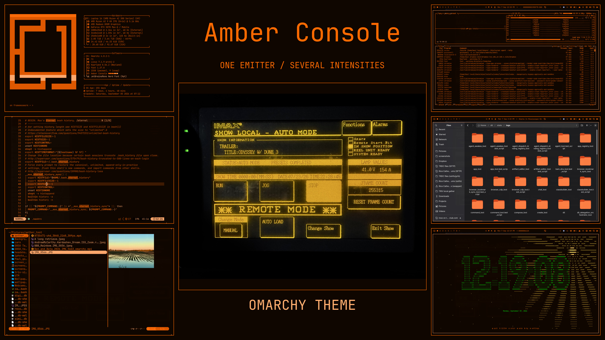
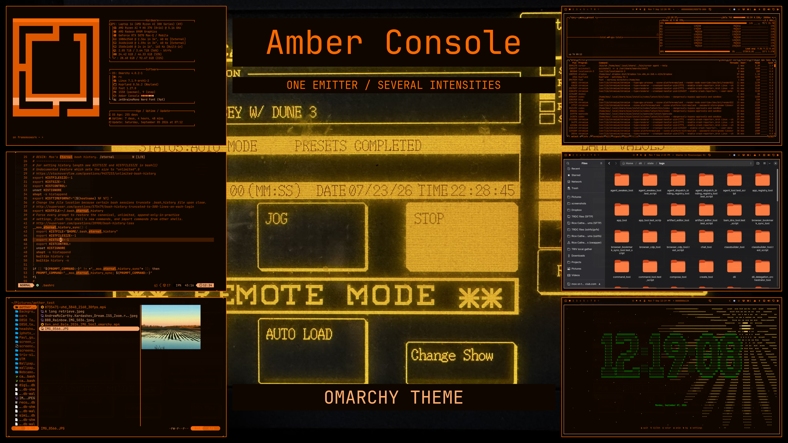

# Amber Console composite recipes

## Canonical theme preview

The root `preview.jpg` is the image Omarchy uses for this theme. Its source
images, recipes, example composites and render records are kept together in
`preview_comp_assets/`. The numbered preview images have been removed; older
images remain recoverable from Git history.

From the theme repository root, regenerate the current preview with:

```bash
theme_composite_tool render preview_comp_assets/showcase_03.json --bottom-center preview_comp_assets/screenshots/screenshot-2026-09-13_08-48-32.png --no-footer --output preview.jpg --replace --json
```

This puts Cliamp in the center, OpenCode in the expanded lower-center sector,
and `screenshot-2026-09-13_10-19-52.png` in top-left sector 10, preserving
the screenshot's built-in outer padding without cropping. The footer is
hidden. The saved recipe already contains slot 6 and `hide_footer: true`;
the explicit flags document the intended layout.

The current record is `preview_comp_assets/preview.jpg.render.json`. Recipe
image paths are relative to the recipe file: screenshots live in its
`screenshots/` subdirectory and the wallpaper remains beside the recipes.
No personal Pictures directory is needed to regenerate it.

## Directory roles

- Root `preview.jpg`: Omarchy theme-selector preview.
- `backgrounds/`: theme wallpapers, consumed by Omarchy.
- `preview_comp_assets/`: our composition inputs, recipes, guide and evidence.
- `preview_comp_assets/screenshots/`: preserved original app captures and
  documentation images, including the README's `terminal.png`. This nested
  directory has no special role in Omarchy's theme selector.

All screenshot inputs and documentation captures are consolidated in the
nested `screenshots/` directory. The former duplicate copies beside the
recipes have been moved there, replacing the matching older copies.

## Saved recipes and examples

`showcase.json` is the original six-panel IMAX-photo layout.
`showcase_02.json` uses Cliamp in the center and retains the footer.
`showcase_03.json` defines the current root preview.

The original center/fill example images are preserved here. To regenerate them
from the repository root:

```bash
theme_composite_tool render preview_comp_assets/showcase.json --output preview_comp_assets/showcase-center.jpg --replace --json
theme_composite_tool render preview_comp_assets/showcase.json --output preview_comp_assets/showcase-fill.jpg --background-mode fill --replace --json
```





## Image positions

| Left column | Center column | Right column |
| --- | --- | --- |
| 10 — top-left | 12 — optional top panel | 2 — top-right |
| 9 — left | background (0 in the help drawing) | 3 — right |
| 8 — bottom-left | 6 — optional bottom panel | 4 — bottom-right |

Named positions such as `top-left` also work. Clock hours 11, 1, 7 and 5 are
aliases for adjacent diagonal slots. The number 0 in the help drawing means
`--background`, not a panel position. Two panels cannot occupy the same slot.

`--bottom-center IMAGE` adds or replaces slot 6 with contain fit.
`--no-footer` gives the full footer sector to slot 6, or to the main image
when slot 6 is absent. Both work with init/plan/render; init saves the choices,
while plan/render apply overrides without editing the recipe.

## Editing and reproducibility

Run `theme_composite_tool -h` for the two numbered layout diagrams.
Use `plan RECIPE --json` to inspect geometry and hashes or
`render RECIPE --output preview.jpg --dry-run --json` to preflight.

Recipes specify title, subtitle, footer, canvas, font, colors, margins, gaps,
borders and contain/cover fit. `background.mode` selects a contained central
image or a full-canvas background. Source screenshots are never stretched.

New render records live in `preview_comp_assets/` inside the output image's
directory. When the image is already in `preview_comp_assets/`, the same
directory is reused without nesting. Each record's `recipe_file` and
`output.file` resolve relative to the record; image paths resolve relative
to the recipe. Records capture hashes, geometry, authored text, font and
renderer identity. Identical inputs and toolchain produce identical image bytes.

The moved historical records retain their original contents; some describe
removed numbered previews or older recipe locations. Current records are
refreshed by the commands above. A different existing output or record needs
`--replace`; the tool refuses overwriting sources.

For theme attribution, licensing and installation, see [README.md](../README.md).
